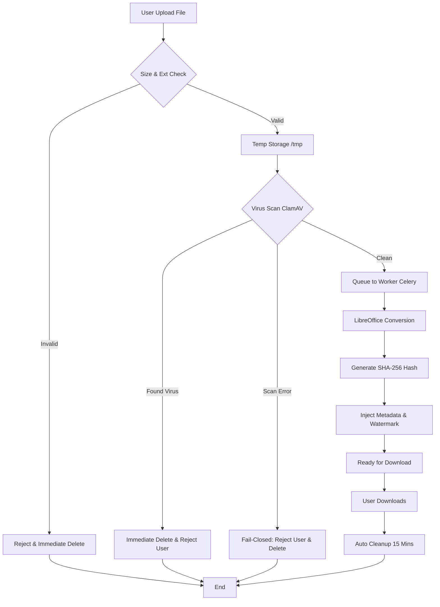

# 🛡️ DocuBRIN - Secured Document Suite

DocuBRIN adalah platform manajemen dokumen berbasis microservices yang dirancang untuk memberikan keamanan maksimal dalam proses konversi dan penggabungan (merging) dokumen. Aplikasi ini dikembangkan dengan filosofi **"Security by Design"**, mengacu pada standar keamanan siber nasional (BSSN) dan internasional (ISO/NIST).

---

## 📋 Daftar Isi
1. [Filosofi Keamanan & Standar](#-filosofi-keamanan--standar)
2. [Fitur Utama](#-fitur-utama)
3. [Arsitektur & Tools](#-arsitektur--tools)
4. [Alur Kerja (Flowchart)](#-alur-kerja-flowchart)
5. [Instalasi & Penggunaan](#-instalasi--penggunaan)
6. [Edukasi Penanganan Malware](#-edukasi-penanganan-malware)
7. [Kebijakan Privasi (Zero-Retention)](#-kebijakan-privasi-zero-retention)

---

## 🛡️ Filosofi Keamanan & Standar

DocuBRIN bukan sekadar alat konversi; ini adalah *security gateway* dokumen Anda. Kami mematuhi:

*   **ISO/IEC 27001:2022 (Control 8.7 & 8.28):** Perlindungan terhadap malware dan keamanan kode melalui mekanisme *Fail-Closed*.
*   **NIST SP 800-83 Rev. 1:** Panduan pencegahan insiden malware. Kami menerapkan prinsip *Eradication* (Pemusnahan) daripada pembersihan yang tidak reliabel.
*   **Peraturan BSSN No. 1 Tahun 2024:** Manajemen insiden siber untuk Sistem Pemerintahan Berbasis Elektronik (SPBE).
*   **Peraturan BSSN No. 4 Tahun 2021:** Penjaminan integritas informasi melalui metadata dan verifikasi digital.

---

## ✨ Fitur Utama

*   🚀 **Secure Conversion:** Mengonversi Office (Word, Excel, PPT) ke PDF dengan membuang elemen aktif berbahaya (Macro/VB Scripts).
*   🔍 **Deep Virus Scanning:** Integrasi ClamAV dengan pembaruan database setiap 30 menit.
*   📑 **Professional Merging:** Penggabungan PDF yang aman dengan pemindaian ulang setiap fragmen.
*   🖋️ **Security Proofing:** 
    *   **SHA-256 Fingerprint:** Hash unik di metadata PDF untuk bukti integritas.
    *   **Security Watermark:** Tanda verifikasi visual di setiap halaman.
    *   **Enhanced Metadata:** Informasi waktu scan dan ID verifikasi permanen dalam file.

---

## 🛠️ Arsitektur & Tools

Aplikasi ini menggunakan teknologi modern yang terisolasi dalam kontainer:

*   **Backend:** [FastAPI](https://fastapi.tiangolo.com/) (Python 3.11) - Performa tinggi dan asinkron.
*   **Engine Konversi:** [LibreOffice Headless](https://www.libreoffice.org/) - Standar industri untuk konversi dokumen yang akurat.
*   **Antivirus Engine:** [ClamAV](https://www.clamav.net/) - Mesin pemindai open-source tingkat enterprise.
*   **Task Queue:** [Celery](https://docs.celeryq.dev/) & [Redis](https://redis.io/) - Memastikan pemrosesan berat dilakukan di background agar API tetap responsif.
*   **Reverse Proxy:** [NGINX](https://www.nginx.com/) - Menambahkan lapisan keamanan transport.
*   **PDF Manipulation:** [PyPDF2](https://pypdf2.readthedocs.io/) & [ReportLab](https://www.reportlab.com/) - Untuk injeksi metadata dan watermarking.

---

## 🔒 Fitur Hardening & Keamanan Terbaru

Aplikasi ini telah diperkeras (*hardened*) dengan pengamanan tambahan:

1.  **Container Hardening:**
    *   **Non-Root Execution:** Semua service (API, Worker, Beat) berjalan sebagai user non-root `docubrin` untuk mencegah eskalasi hak akses.
    *   **Network Segmentation:** Pemisahan jaringan antara `frontend` (akses publik via Nginx) dan `backend` (internal-only untuk Redis & ClamAV).
    *   **Resource Management:** Limitasi memori pada setiap container untuk mencegah serangan *Resource Exhaustion*.
2.  **Infrastructure Hardening:**
    *   **Redis Security:** Dilengkapi dengan autentikasi password untuk akses broker task.
    *   **Nginx Security Headers:** Implementasi CSP, HSTS, X-Frame-Options, dan XSS Protection.
    *   **Rate Limiting:** Pembatasan jumlah request (10r/s) untuk mencegah brute-force dan DDoS ringan.
3.  **Application Hardening:**
    *   **Path Traversal Protection:** Sanitasi ketat pada nama file dan ID download untuk mencegah akses file sistem.
    *   **Extension Filtering:** Hanya mengizinkan ekstensi file tertentu untuk proses konversi dan merging.
    *   **Subprocess Isolation:** Penambahan *timeout* pada engine LibreOffice untuk mencegah DoS lewat dokumen kompleks/malicious.
    *   **Dependency Pinning:** Menggunakan versi library yang spesifik (pinned) untuk mencegah serangan *supply chain*.

---

## 📊 Alur Kerja (Flowchart)



---

## 🚀 Instalasi & Penggunaan

### Prasyarat
*   Docker & Docker Compose

### Langkah-langkah
1.  **Clone Repository**
    ```bash
    git clone https://github.com/ddt-mmt/docubrin.git
    cd docubrin
    ```
2.  **Build & Run**
    ```bash
    docker-compose up -d --build
    ```
3.  **Verifikasi Layanan**
    Buka browser dan akses `http://localhost:8080`.

---

## 💡 Edukasi Penanganan Malware

### Mengapa file bervirus tidak "dibersihkan"?
Berdasarkan standar **NIST SP 800-83**, pembersihan file (disinfection) otomatis tidak disarankan karena:
1.  **Residu Malware:** Virus modern sering meninggalkan jejak permanen (persistence) yang tidak bisa dihapus 100%.
2.  **Integritas Cacat:** File yang pernah terinfeksi dianggap sudah tidak memiliki integritas kode yang sah.
3.  **Keamanan Ekosistem:** Meneruskan file yang "pernah" bervirus berisiko tinggi bagi penerima dokumen selanjutnya.

**Solusi:** DocuBRIN menerapkan **Reject & Destroy**. Jika file Anda ditolak, silakan gunakan antivirus desktop untuk membersihkan file asli atau gunakan versi backup sebelum file terinfeksi.

---

## 🔒 Kebijakan Privasi (Zero-Retention)

Keamanan data Anda adalah prioritas kami:
*   **Immediate Destruction:** Setiap file yang terdeteksi bervirus atau ditolak karena kesalahan sistem akan **langsung dihapus secara permanen** dari penyimpanan sementara tanpa pengecualian.
*   **No Permanent Storage:** Kami tidak menyimpan file Anda di database atau storage permanen.
*   **Volatile Storage:** Semua proses dilakukan di `/tmp` (RAM-backed storage jika dikonfigurasi).
*   **Janitor Process:** Worker otomatis menghapus file sisa (input/output) setiap 15 menit.

---

## 📄 Lisensi

Proyek ini dilisensikan di bawah **MIT License**. Lihat file `LICENSE` untuk detail lebih lanjut.

---
**Verified Secure by DocuBRIN Security Engine**
